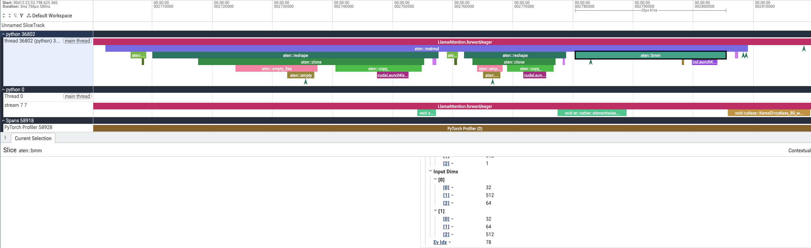
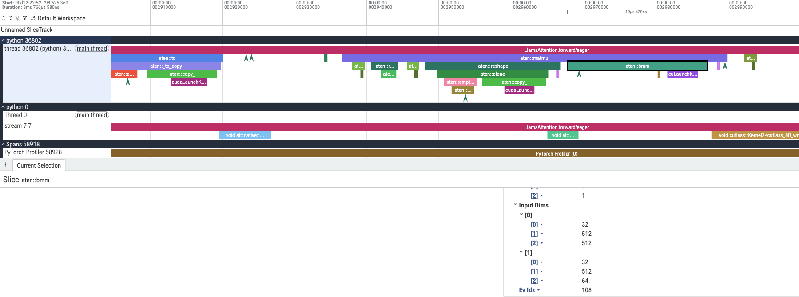
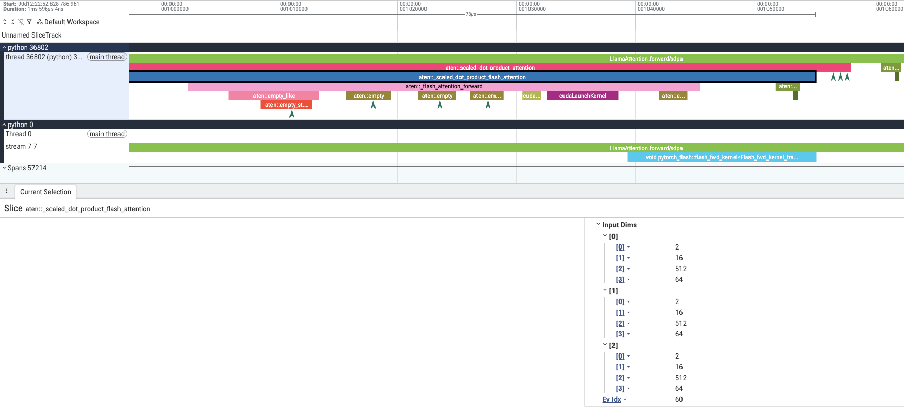
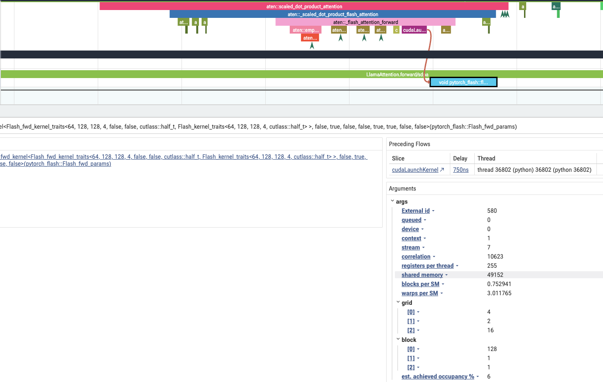
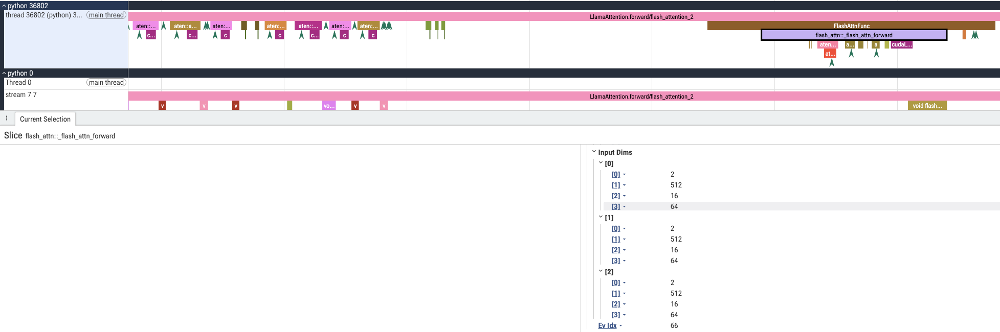
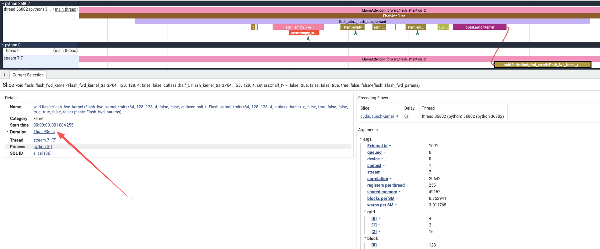

# 作业一：Attention module 的三组 Profiling 对比

## 1. 实验目的

本实验只选取一个 module：为了具有代表性，我们直接使用开源仓库 `transformers` 中的 `LlamaAttention`的module。关注它在 GPU 上执行了哪些 kernel、执行顺序与耗时，以及 kernel 的 grid/block 配置。

设置三个对比组：原始 Attention（`eager`模式，即非 compile 的小算子）、Pytorch SDPA（`sdpa`，使用 Pytorch 封装好的 Attention 算子）和独立 flash-attn 包（`flash_attention_2`）。三组直接调用相同的 transformers module 实现，只切换 Attention backend，使用相同的输入与权重。

## 2. 实验配置

实验于 2026 年 10 月 1 日在 RTX 5090 的物理 GPU 4 上完成。开始时该卡没有计算进程，显存占用为 2 MiB，利用率为 0；其他卡仍有占卡脚本运行。实验结束后已释放 GPU 4。

| 配置项                       | 设置                                           |
| ------------------------- | -------------------------------------------- |
| GPU                       | NVIDIA GeForce RTX 5090，170 个 SM 计算单元的版本     |
| Python / Pytorch          | Python 3.11.16，PyTorch 2.8.0+cu128           |
| Transformers / flash-attn | 4.57.1 / 2.8.3                               |
| 输入                        | `[batch，sequence，hidden] = [2，512，1024]` |
| Attention                 | 16 个 Q/K/V head，head dimension 64，causal     |
| 精度                        | FP16，dropout 0，关闭梯度，不使用 KV cache             |
| 权重                        | 固定种子 20261001 的随机权重，三组完全相同                   |

本实验没有下载预训练模型。新环境单独创建，原有环境未更新。完整版本记录见 [environment.freeze.txt](../homework1/environment.freeze.txt)。

## 3. 代码与采集范围

完整代码在 [homework1/run.py](../homework1/run.py)。使用的 module 直接来自 Transformers：

```python
from transformers import LlamaConfig
from transformers.models.llama.modeling_llama import LlamaAttention

config = LlamaConfig(
    hidden_size=1024,
    num_attention_heads=16,
    num_key_value_heads=16,
    head_dim=64,
    attention_dropout=0.0,
)
config._attn_implementation = backend  # eager / sdpa / flash_attention_2
module = LlamaAttention(config，layer_idx=0).cuda().half().eval()
```

完整脚本另外加载同一份权重，并准备 hidden states、RoPE 的 cos/sin 和 causal mask。eager 接收提前构造的四维加性 mask；SDPA 和 flash-attn 使用模块的 causal 设置，两者接收 `attention_mask=None`。三组都对相同序列执行因果 Attention。

每组先预热 20 次，再采集一次完整的 `module(**arguments)`。只在 module 外层放一个标记，不改动 Transformers 源码，也不给 Q/K/V、softmax 等内部步骤添加手工标记。

```python
with profile(
    activities=[ProfilerActivity.CPU，ProfilerActivity.CUDA],
    record_shapes=True,
    profile_memory=True,
    with_stack=False,
) as profiler:
    with record_function(f"LlamaAttention.forward/{backend}"):
        output = module(**arguments)
    torch.cuda.synchronize()

profiler.export_chrome_trace(str(destination))
```

采集范围包含 Q/K/V 投影、RoPE 应用、Attention 核心计算以及输出投影。RoPE cos/sin 和 mask 的准备位于 module 调用之前，因此不在 trace 中。Profiler 自动记录内部的 PyTorch 算子和 CUDA kernel。

## 4. 三个 trace 文件

分别导入 Perfetto，查看关键位置的 kernel 计算。

### 原始 Attention（eager模式）


这里可以看到是 eager 模式下，$QK^\top$ 的矩阵乘法的核心部分。$QK^\top$ 会在 CPU 的 profiler 中看到 `torch.bmm` 算子。


这次的截图可以看到是 eager 模式下的，softmax($QK^\top$ / $\sqrt{d_{head}}$) @ V 的矩阵乘法的核心部分，会在 CPU 的 profiler 中看到 `torch.bmm` 算子。

从截图中的 shape 可以确认，eager 模式下的 Attention 输入为 `[batch, num_heads, sequence, hidden_size]`，即 `[2, 16, 512, 64]`。`torch.matmul` 会把 batch 和 head 两维压平，因此 `aten::bmm` 实际看到的是：

- 第一个 `aten::bmm`（$QK^\top$）：input 0 为 `[32, 512, 64]`，input 1 为 `[32, 64, 512]`，output 为 `[32, 512, 512]`。
- 第二个 `aten::bmm`（PV）：input 0 为 `[32, 512, 512]`，input 1 为 `[32, 512, 64]`，output 为 `[32, 512, 64]`。


### SDPA模式下的Attention



这里可以看到是 SDPA 模式下的 Attention 核心计算通过算子 `aten::scaled_dot_product_attention` 进入。本次 trace 中，它进一步调用 `aten::_scaled_dot_product_flash_attention`，再进入 `aten::_flash_attention_forward`。这说明本配置下，Pytorch 的 SDPA 接口选择了内置的 Flash Attention 实现。

与 eager 模式中的两个 `aten::bmm` 相比，这里将 $QK^\top$、缩放、causal mask、softmax 和 PV 的计算交给融合实现完成。因此，在这部分 trace 中不会再看到独立的 `aten::bmm` 和 `aten::softmax`，但对应的数学计算仍然存在。

从 trace 中的 shape 可以确认：

- `aten::scaled_dot_product_attention` 的 input 0、input 1、input 2 分别为 Q、K、V，shape 都是 `[2, 16, 512, 64]`，即 `[batch, num_heads, sequence, head_dim]`，没有像 eager 的 `aten::bmm` 那样把 batch 和 head 压平为 32。
- 继续展开到 `aten::_flash_attention_forward`，Q、K、V 的 shape 都变成了 `[2, 512, 16, 64]`。这是内部接口交换了 sequence 和 head 两个维度的顺序，但是 batch、head 数和序列长度并没有改变。
- 参数中还可以看到 `is_causal=True`，缩放系数为 `0.125`，即 $1/\sqrt{64}$，与 eager 模式的因果注意力计算一致。



对应的 GPU 核心部分是一个 `pytorch_flash::flash_fwd_kernel`，本次 trace 中耗时为 `15.872 μs`，`grid=(4, 2, 16)`，`block=(128, 1, 1)`，即 128 个 block，每个 block 128 个线程。上面三个 CPU 算子是逐层调用关系，不能把它们当作三个独立的 Attention GPU kernel。

### flash-attn模式计算 Attention



这里可以看到，独立 flash-attn 包通过 `FlashAttnFunc` 调用 `flash_attn::_flash_attn_forward`。这一组没有经过 `aten::scaled_dot_product_attention`，因此可以从 CPU 算子名称上与上一组 SDPA 区分开。它同样将 Attention 核心计算融合执行，不再单独显示 eager 模式中的两个 `aten::bmm` 和 softmax 算子。

从 trace 中的 shape 可以确认：

- `FlashAttnFunc` 和 `flash_attn::_flash_attn_forward` 的 input 0、input 1、input 2 分别为 Q、K、V，shape 都是 `[2, 512, 16, 64]`，即 `[batch, sequence, num_heads, head_dim]`。
- 与 SDPA 外层接口的 `[2, 16, 512, 64]` 相比，这里 sequence 和 head 的顺序不同。但与 SDPA 内部 `aten::_flash_attention_forward` 接收的布局一致。三组仍然使用相同的 Q、K、V 数据，只是接口呈现的布局不同。
- 该算子的 causal 参数为 `True`，缩放系数同样为 `0.125`，dropout 为 0，与前两组保持一致。



对应的 GPU kernel 名称是 `flash::flash_fwd_kernel`，与 SDPA 组的 `pytorch_flash::flash_fwd_kernel` 命名空间不同，可以确认本组执行的是独立 flash-attn 包的实现。本次 trace 中，该 kernel 耗时为 `15.936 μs`，`grid=(4, 2, 16)`，`block=(128, 1, 1)`，与 SDPA 组的启动配置相同。

三组的区别主要体现在 Attention 核心部分：eager 将矩阵乘法、缩放、mask 和 softmax 等步骤拆开执行；SDPA 由 Pytorch 的统一接口选择后端，本次选中了内置 Flash Attention；flash-attn 则调用独立包提供的融合算子。两组融合实现都保留了外部的 Q/K/V 投影、RoPE 和输出投影，因此本次完整 module 各有 15 个 kernel，只有中间的 Attention 核心计算对应一个融合 kernel。这里的融合由后端算子本身提供，本实验三组均没有使用 `torch.compile`。

## 5. Trace 中观察到的区别

| 对比组        | 完整 module 的 CUDA kernel 数 | 实际 Attention 路径                             |
| ---------- | ------------------------: | ------------------------------------------- |
| eager      |                        24 | 矩阵乘法、缩放、mask 相加、softmax 等分开执行               |
| SDPA       |                        15 | `aten::_scaled_dot_product_flash_attention` |
| flash-attn |                        15 | `flash_attn::_flash_attn_forward`           |

三组开头都包含 Q、K、V 的三次投影，以及 RoPE 相关的逐元素计算。eager 随后执行单独的 QK 矩阵乘法、缩放、mask 相加、softmax、类型转换和 PV 矩阵乘法，并伴随布局复制；最后执行输出投影。

本配置下，SDPA 选择了 PyTorch 自带的 Flash Attention kernel，其名称以 `pytorch_flash::flash_fwd_kernel` 开头。第三组则调用独立 flash-attn 包，kernel 名称以 `flash::flash_fwd_kernel` 开头。两组均将 Attention 核心计算融合为一个 kernel，整个 module 的 kernel 数因此相同。

这说明 SDPA 是一个会选择底层算法的接口；不能将“SDPA”和“Flash Attention 算法”理解为互斥关系。本实验区分的是 Transformers 的三个 backend 入口，并通过实际算子名称确认执行路径。

以启动配置为例：

- Q/K/V 投影的 `grid=(128，1，1)`、`block=(128，1，1)`，表示 128 个 block，每个 block 128 个线程。
- 两组融合 Attention kernel 的 `grid=(4，2，16)`、`block=(128，1，1)`，同样是 128 个 block，每个 block 128 个线程。
- eager 的 softmax 使用 `grid=(4096，1，1)`、`block=(32，4，1)`，每个 block 仍为 128 个线程。

grid/block 是启动配置，不能直接说明每个 SM 实际同时驻留了多少 block。全部 kernel 的名称、顺序、持续时间与启动配置保存在 [results.json](../homework1/results/rtx5090/results.json)。

## 6. 耗时与输出检查

性能计时在 Profiler 之外进行，用 CUDA Event 包围一次完整 module 前向，重复 30 次取中位数。没有使用 CUDA Graph，没有使用 torch.compile，因此计时区间会包含 GPU 等待主机继续发射 kernel 的间隔。

| 对比组        | 完整前向 Event 中位数（μs） | 本次 trace 的 kernel 耗时之和（μs） |
| ---------- | -----------------: | -------------------------: |
| eager      |            294.464 |                    190.621 |
| SDPA       |            257.488 |                    110.815 |
| flash-attn |            317.680 |                    111.103 |

两列来自不同的采集过程，不应混在一起计算比例。SDPA 与 flash-attn 的 kernel 数相同、GPU kernel 耗时之和也接近，但本次 flash-attn 的完整前向 Event 中位数更高。结果不能简化为“kernel 更少，整个 module 就一定更快”；Python 调用和发射间隔等开销也会进入当前计时，具体差异原因尚未进一步隔离。

相对 eager，SDPA 和 flash-attn 的最大绝对误差均为 `0.00048828125`，相对 L2 误差均约为 `0.000450`，通过 `atol=rtol=0.002` 的逐元素检查。另将输入后半段 token 加上扰动，三组前半段的输出均保持一致，因果性检查通过。

