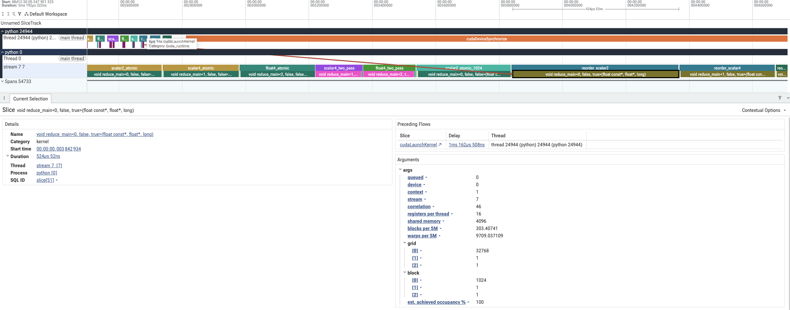
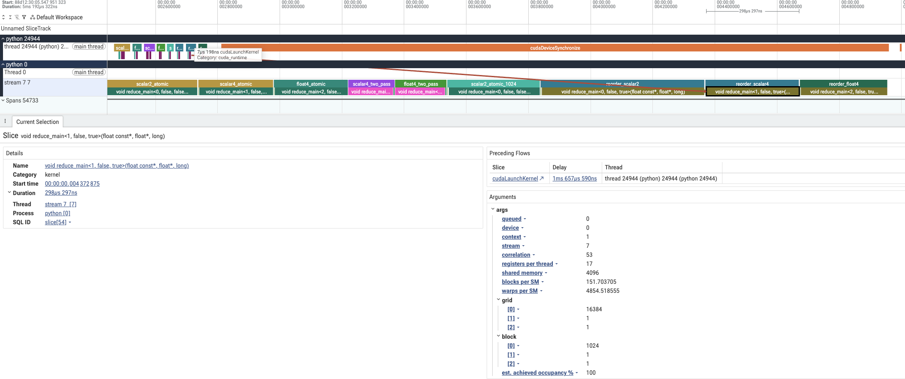
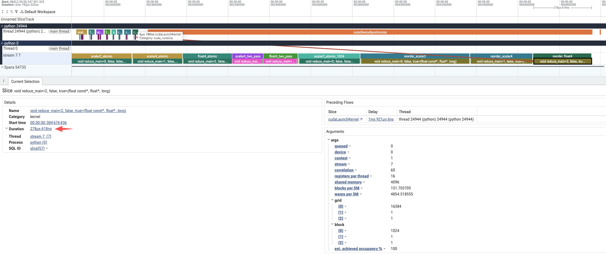
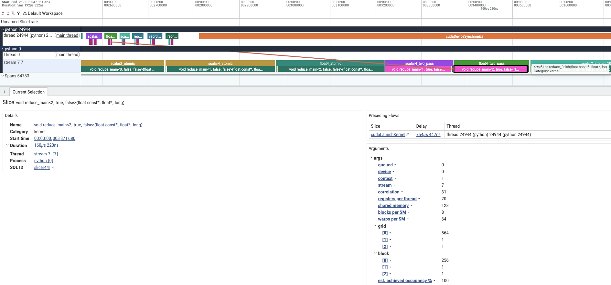

# 作业二：Reorder Reduce 的 float4 改写与性能对比

## 1. 实验目的

本实验将课程中的 reorder reduction 改为 float4 读取，计算一个 FP32 向量的元素和。主要观察每个线程读取的数据量、block 数量和归约方式变化后，kernel 的执行情况与耗时。

原始算法来自课程仓库的 [4\_reorder\_reduce.py](<../AI-Infra-Seminar/Part I/4_reorder_reduce.py>)：每个线程读取两个元素，在 shared memory 中完成 block 内归约，最后通过 `atomicAdd` 合并各 block 的结果。本实验将这段算法整理到统一的 CUDA extension 中，保留其归约方式，另外增加每线程读取四个标量的对照和 float4 版本。计时接口改为预分配输出，并使用 PyTorch 当前 stream，因此下文的“课程基线”指这个移植版本。

库实现对照直接调用 PyTorch 的 `torch.sum`。三组 reorder 实现用于分析改写本身的收益，`torch.sum` 用于比较已有库在相同输入上的表现。

## 2. 实验配置

| 配置项              | 设置                                                         |
| ---------------- | ---------------------------------------------------------- |
| GPU              | NVIDIA A800-SXM4-80GB，108 个 SM，物理 GPU 2                    |
| Python / PyTorch | Python 3.11.14，PyTorch 2.10.0+cu128                        |
| CUDA 编译器         | nvcc 12.5.40，目标架构 sm\_80                                   |
| 输入 / 输出          | 连续的一维 FP32 向量 / 一个 FP32 标量                                 |
| 性能测试长度           | 256、4,096、65,536、1,048,576、16,777,216、67,108,864、1,048,579 |
| Trace 输入         | `N=67,108,864`，输入数据共 256 MiB                               |
| 随机种子             | 20260929                                                   |

输入、输出和临时缓冲区提前分配。原子归约的输出清零、两阶段归约的最终求和都计入耗时；编译、输入生成和 CPU 到 GPU 的数据传输不计入。

## 3. 代码与采集范围

实验入口在 [homework2/run.py](../homework2/run.py)，CUDA 实现在 [common/kernels.cu](../common/kernels.cu)，统一计时函数在 [common/bench.py](../common/bench.py)。三组 reorder 使用相同的输入和 1,024 个线程的 block：

```python
# x、y、scratch 已提前分配；mod 是编译好的 CUDA extension。
mod.reduce_out(x, y, scratch, 5, 1024, cap)  # reorder_scalar2
mod.reduce_out(x, y, scratch, 6, 1024, cap)  # reorder_scalar4
mod.reduce_out(x, y, scratch, 7, 1024, cap)  # reorder_float4

# 库实现对照，直接调用 PyTorch。
torch.sum(x, dim=(0,), out=y)
```

`reorder_scalar2` 的每个线程读取两个元素；`reorder_scalar4` 改为四个标量读取；`reorder_float4` 则由一个线程读取四个相邻的 FP32 元素。float4 分支的核心代码如下：

```cpp
int64_t i = base + int64_t(threadIdx.x) * 4;
if (i + 3 < n) {
    float4 v = reinterpret_cast<const float4*>(x)[i / 4];
    a += v.x; b += v.y; c += v.z; d += v.w;
}
```

这里只摘录完整四元素的分支。实际代码对末尾不足四个的元素逐个读取；入口检查输入地址是否按 16 字节对齐，未对齐时回退到标量版本。三组随后都将线程的局部和写入 shared memory，按步长减半的方式归约，最后由每个 block 的一个线程执行 `atomicAdd`。

Profiler 在每次完整的 `reduce_out` 调用外放一个标记，输出清零和后续 kernel 都包含在这个范围内：

```python
with profile(
    activities=[ProfilerActivity.CPU, ProfilerActivity.CUDA],
    record_shapes=True,
) as profiler:
    for name, (mode, threads) in VARIANTS.items():
        with record_function(name):
            mod.reduce_out(x, y, scratch, mode, threads, cap)
    torch.cuda.synchronize()
```

## 4. Profiler 采集与分析

这里通过 Python 标记关联 GPU kernel。输入长度来自采集代码；自定义 extension 的参数没有像作业一的 ATen 算子那样显示为完整的 Input Dims。

### 课程基线：reorder\_scalar2



我们从这里可以看到，GPU 先执行一次 `Memset (Device)` 将输出清零，再执行归约 kernel。kernel 的 `grid=(32768, 1, 1)`，`block=(1024, 1, 1)`，即 32,768 个 block，每个 block 1,024 个线程。

每个线程处理两个元素，因此每个 block 处理 2,048 个元素，正好对应 `67,108,864 / 2,048 = 32,768` 个 block。每个 block 最后向同一个输出地址做一次原子加法。本次 trace 中，归约 kernel 耗时为 `524.052 μs`，清零是另外一个 GPU 操作。

### 标量对照：reorder\_scalar4



这一组仍然使用标量读取和 shared memory 归约，但每个线程处理四个元素。`block=(1024, 1, 1)` 保持不变，`grid` 减为 `(16384, 1, 1)`，block 数和最终的原子加法次数都减少了一半。本次 trace 中，归约 kernel 耗时为 `298.297 μs`。

这一组用于区分“每线程处理更多数据”和“使用 float4 读取”的影响。如果只比较原来的 scalar2 与 float4，两种变化会同时发生。

### float4 改写：reorder\_float4



这一组的 `grid=(16384, 1, 1)`、`block=(1024, 1, 1)` 与 scalar4 相同，每个线程处理的元素数也相同。主要变化是读取方式：scalar4 分别读取四段中的元素，float4 一次读取四个连续元素。block 内的归约和最后的原子加法保持一致。本次 trace 中，归约 kernel 耗时为 `278.618 μs`。

Trace 可以确认执行了哪个模板实例，但不能单独证明编译后的加载指令宽度。已有 [kernels.sass.txt](../validation/kernels.sass.txt) 中，`reduce_main<2, false, true>` 对应函数内可以找到 `LDG.E.128.CONSTANT`，说明这个版本包含 128 bit 的全局内存加载指令。

### 补充对比：float4\_two\_pass



这里可以看到两个 kernel。第一阶段的 `grid=(864, 1, 1)`、`block=(256, 1, 1)`，每个 block 通过 grid-stride 循环处理多段输入，将局部和写到临时数组。第二阶段 `reduce_finish` 使用一个 256 线程的 block，将这 864 个局部和合并为最终输出。

本次 trace 中，两段 kernel 分别耗时 `160.220 μs` 和 `4.064 μs`。这个版本取消了所有 block 向同一地址执行的原子加法，并使用 warp shuffle 完成 block 内归约。它同时改变了归约方式、线程数和 grid，因此作为额外优化展示，不能将它与课程基线的全部差距归因于 float4。

## 5. Trace 中观察到的区别

| 对比组               | 每线程每轮读取        | 第一阶段 block 数 | block 内归约                       | block 之间合并 |
| ----------------- | -------------- | -----------: | ------------------------------- | ---------- |
| reorder\_scalar2  | 两个标量           |       32,768 | shared memory，步长减半              | atomicAdd  |
| reorder\_scalar4  | 四个标量           |       16,384 | shared memory，步长减半              | atomicAdd  |
| reorder\_float4   | 一个 float4      |       16,384 | shared memory，步长减半              | atomicAdd  |
| float4\_two\_pass | 一个 float4，循环处理 |          864 | warp shuffle + 少量 shared memory | 第二个 kernel |

前三组都是“输出清零 + 一个归约 kernel”。两阶段版本虽然增加了一个 kernel，却减少了第一阶段的 block 数，并改变了局部结果的合并方式。因此，kernel 数量本身不能决定速度。

表中的 block 数是整个 grid 的大小。两阶段配置里的 `864=108×8` 只是总 block 数的设置，并不表示每个 SM 同时驻留八个 block。现有记录没有提供硬件计数器测得的实际驻留数量。

## 6. 耗时与输出检查

性能计时在 Profiler 之外完成。先预热，再通过 CUDA Graph 重放一批调用，用 CUDA Event 记录整批 GPU 耗时并除以调用次数，重复九组取中位数。输入和缓冲区重复使用。下面是完整归约调用的耗时，与第四节单次 trace 中的 kernel Duration 分开比较。

| 对比组               | N=1,048,576（μs） | N=67,108,864（μs） |
| ----------------- | --------------: | ---------------: |
| reorder\_scalar2  |          10.695 |          400.981 |
| reorder\_scalar4  |           8.777 |          232.724 |
| reorder\_float4   |           8.507 |          217.635 |
| float4\_two\_pass |           5.537 |          160.009 |
| PyTorch torch.sum |           9.800 |          178.369 |

在 `N=67,108,864` 时，float4 改写相对课程基线约快 `1.84` 倍。但与每线程同样读取四个元素的 scalar4 相比，约为 `1.07` 倍。这说明本次收益中，每线程处理量增加、block 数与原子加法次数减少占了较大部分；宽加载带来的额外提升需要通过 scalar4 对照来看。

直接 float4 改写仍慢于 `torch.sum`；两阶段 float4 在这个尺寸下约快于 `torch.sum` `1.11` 倍。这个结果对应固定输入、缓冲区复用和当前 GPU 配置，不能据此认为自定义实现对所有输入都更快。GPU 频率未锁定，服务器其他卡上也有工作负载。

另对两阶段 float4 扫描了 128 / 256 / 512 个线程，以及总 grid 为 SM 数的 2 / 4 / 8 / 16 倍，共 12 组配置。单独这轮扫描中，256 线程、432 个 block 的中位数为 `157.890 μs`。该结果保存在 [tuning.json](../homework2/results/a800/tuning.json)，上表仍使用事先固定的 256 线程、864 个 block，未用扫描结果替换。

正确性检查使用 `x.double().sum()` 作为参考，覆盖空输入、小于一个 warp 的输入、非整齐长度、偏移一个元素的未对齐地址，以及全一、正负交替和大数相消等数据，共 342 个数值用例，均通过。误差判定为 `abs_error <= 2e-6 * sum(abs(x)) + 1e-6`；浮点加法顺序变化会影响结果，这不代表逐位相等，尤其大数相消时该容差可能较宽。

非连续输入和 FP64 输入按预期被拒绝，非默认 stream 检查通过。Compute Sanitizer 的归约 memcheck 记录为 `ERROR SUMMARY: 0 errors`。完整数据见 [results.json](../homework2/results/a800/results.json)、[correctness.json](../homework2/results/a800/correctness.json) 和 [memcheck.log](../validation/memcheck.log)。
