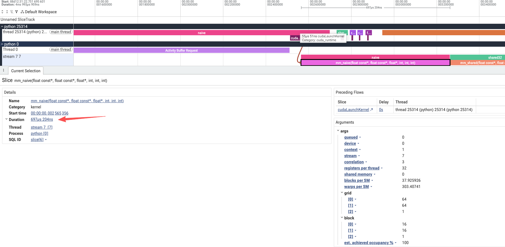
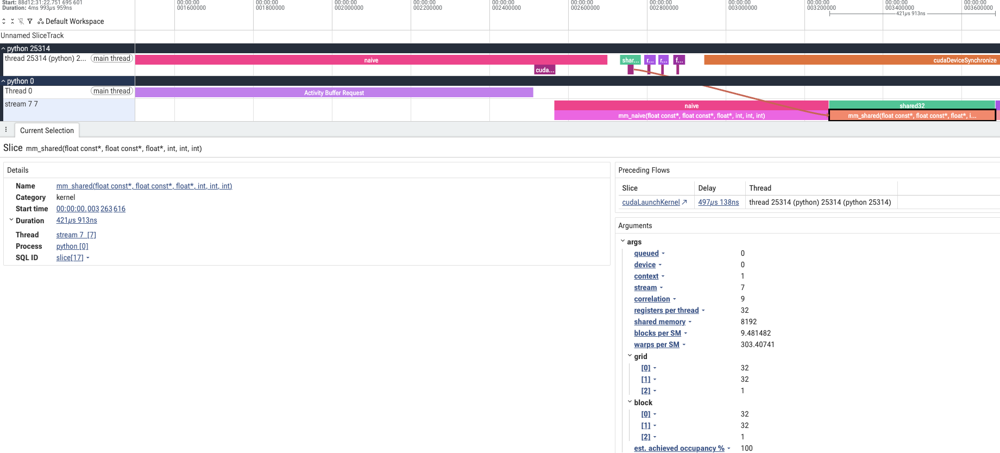
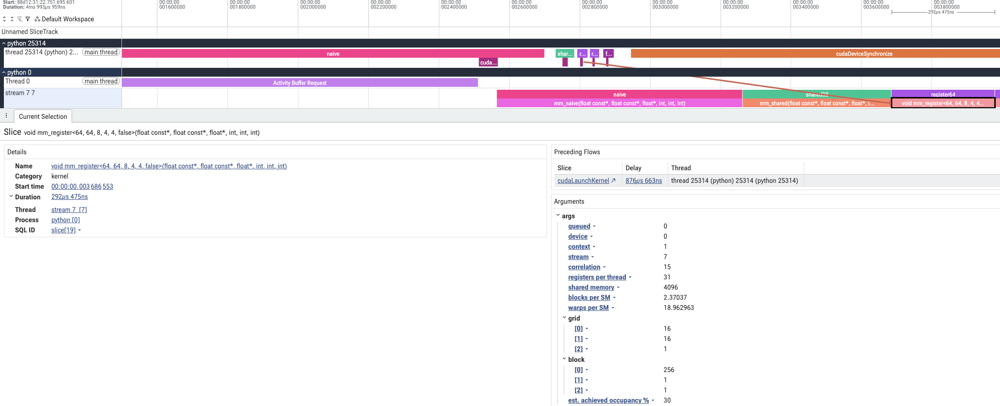
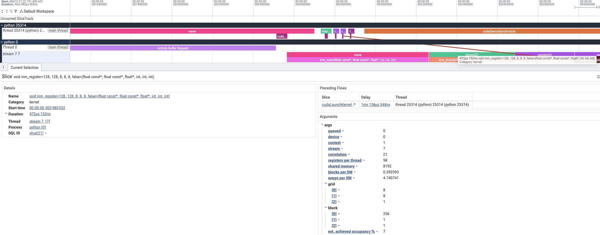
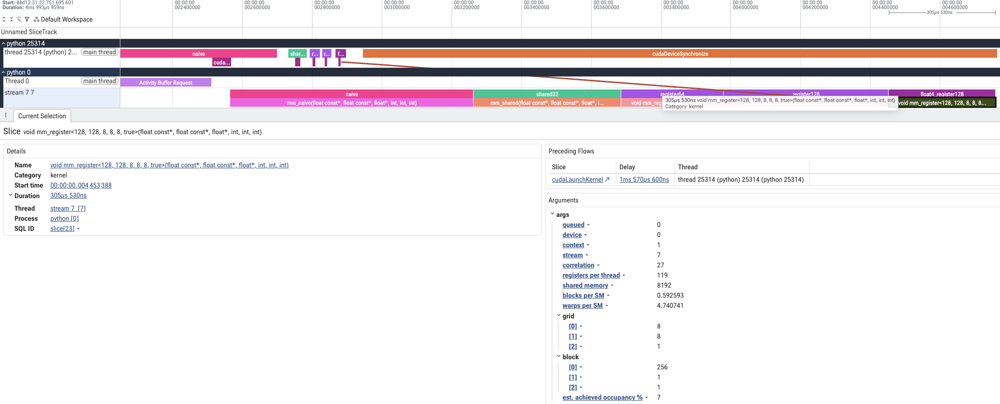
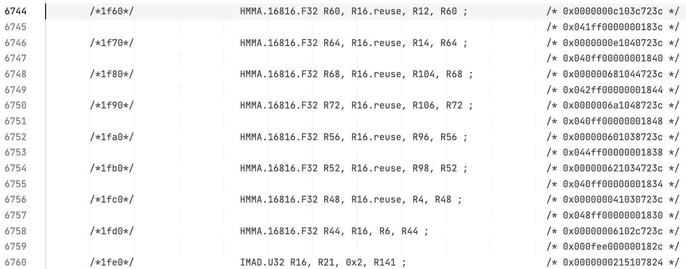

# 作业三：大模型生成 CUDA Matmul 的实现与性能对比

## 1. 实验目的

本实验使用大模型生成 CUDA 矩阵乘法代码，计算 `C = A @ B`，比较朴素实现、shared memory 分块、寄存器分块和 float4 读写的效果。库实现对照直接调用 PyTorch 的 `torch.mm`，关注生成的代码是否正确，以及与已有库之间还有多大差距。

本次 CUDA 代码由 Codex 生成，参考课程仓库的 [0_naive_matmul.py](<../AI-Infra-Seminar/Part II/0_naive_matmul.py>) 和 [4_vectorized.py](<../AI-Infra-Seminar/Part II/4_vectorized.py>)。课程源码保留原样，实际测量的是 [common/kernels.cu](../common/kernels.cu) 中的实现。例如，本实验朴素版本使用 `16×16` 个线程，课程朴素示例使用 `32×32`，二者不能当作同一份代码的测量结果。

生成时的主要约束是：使用 row-major 布局、处理 M/N/K 的尾部、使用 PyTorch 当前 stream、预分配输出，并与同精度的 PyTorch 结果比较。各版本在测量前一并生成，随后统一编译、验证和计时。生成约束与实现记录见 [GENERATION_NOTES.md](../homework3/GENERATION_NOTES.md)。

## 2. 实验配置

| 配置项 | 设置 |
| --- | --- |
| GPU | NVIDIA A800-SXM4-80GB，108 个 SM，物理 GPU 2 |
| Python / PyTorch | Python 3.11.14，PyTorch 2.10.0+cu128 |
| CUDA 编译器 | nvcc 12.5.40，目标架构 sm_80，未开启 fast-math |
| 矩阵布局 | 连续的 row-major，`A[M,K]`、`B[K,N]`、`C[M,N]` |
| 主要对比 | FP32 输入、累加和输出，关闭 TF32 |
| 补充对比 | FP16 输入，WMMA 使用 FP32 累加和输出 |
| Trace 输入 | `M=N=K=1024`，FP32 |
| 随机种子 | 20260929 |

性能测试包含边长为 128、512、1024、2048、4096 的方阵，以及 `(M,N,K)=(1024,4096,1024)`、`(1024,1024,4096)`、`(513,769,257)` 三种形状。最后一组用于观察非对齐尺寸下的尾部处理。

## 3. 代码与采集范围

实验入口在 [homework3/run.py](../homework3/run.py)，CUDA 实现在 [common/kernels.cu](../common/kernels.cu)。五个 FP32 版本使用相同的输入和预分配输出，通过 `mode` 选择实现：

```python
# a: [M, K]，b: [K, N]，c: [M, N]，均为连续的 CUDA FP32 张量。
torch.backends.cuda.matmul.allow_tf32 = False

mod.matmul_out(a, b, c, 0)  # naive
mod.matmul_out(a, b, c, 1)  # shared32
mod.matmul_out(a, b, c, 2)  # register64
mod.matmul_out(a, b, c, 3)  # register128
mod.matmul_out(a, b, c, 4)  # float4_register128

# 库实现对照，直接调用 PyTorch。
torch.mm(a, b, out=c)
```

| 实现 | 一个 block 计算的输出区域 | 每线程计算的输出 | 主要变化 |
| --- | --- | --- | --- |
| naive | 16×16 | 一个元素 | 沿 K 维直接读取 A、B 并累加 |
| shared32 | 32×32 | 一个元素 | 每轮将 A、B 的 32×32 数据块放入 shared memory |
| register64 | 64×64 | 4×4 | 每线程保存多个累加值，K 维每轮处理 8 个元素 |
| register128 | 128×128 | 8×8 | 扩大输出分块，保持 K 维步长为 8 |
| float4_register128 | 128×128 | 8×8 | 在上一组基础上增加 float4 全局内存读写 |

寄存器分块的三个版本都使用 256 个线程。A 在 shared memory 中按转置布局存放，线程将读出的 A、B 元素复用于多个输出的累加。float4 版本保留相同的计算分块，在满足地址和维度对齐条件时使用向量读写，边界位置通过标量访问处理。

Profiler 在一次完整的 `matmul_out` 调用外添加标记，不在加载、乘加和写回等 kernel 内部步骤分别加标记：

```python
with profile(
    activities=[ProfilerActivity.CPU, ProfilerActivity.CUDA],
    record_shapes=True,
) as profiler:
    for name, mode in VARIANTS.items():
        with record_function(name):
            mod.matmul_out(a, b, c, mode)
    torch.cuda.synchronize()
```

## 4. Trace 文件与关键位置分析

本次 A、B、C 都是 `[1024,1024]`，该尺寸由采集代码确定。自定义 extension 的标记没有完整的 Input Dims，可通过标记名称定位调用，再查看 GPU kernel 的名称、grid 和 block。

### 朴素矩阵乘法：naive



这里可以看到，整个矩阵乘法由一个 kernel 完成。`grid=(64, 64, 1)`，`block=(16, 16, 1)`，即 4,096 个 block，每个 block 256 个线程。一个线程负责一个输出元素，沿 K 维执行 1,024 次乘加，不使用 shared memory。本次 trace 中，kernel 耗时为 `697.204 μs`。

这个实现最直接，但相邻输出需要的 A、B 元素会重复读取。后面的版本主要通过在 block 内复用输入来减少这部分开销。

### Shared memory 分块：shared32



这一组的 `grid=(32, 32, 1)`，`block=(32, 32, 1)`，共 1,024 个 block，每个 block 1,024 个线程。每轮先把 A、B 的两个 `32×32` 数据块放入 shared memory，线程同步后完成这一段 K 维的乘加，再同步并进入下一轮。

两个 FP32 数据块占用 `2×32×32×4=8192` 字节，与 trace 中的 shared memory 字段一致。本次 kernel 耗时为 `421.913 μs`。加载和乘加仍在同一个 kernel 中完成，所以时间线上没有单独的“shared memory 加载 kernel”。

### 寄存器分块：register64 与 register128




`register64` 对应 `mm_register<64, 64, 8, 4, 4, false>`。它使用 `grid=(16, 16, 1)`、`block=(256, 1, 1)`，每个线程计算 `4×4` 个输出。本次 kernel 耗时为 `292.475 μs`，每线程使用 31 个寄存器。

`register128` 对应 `mm_register<128, 128, 8, 8, 8, false>`。它将每个 block 的输出区域扩大为 `128×128`，因此 grid 变成 `(8, 8, 1)`，只有 64 个 block；block 仍为 256 个线程，每线程计算 `8×8` 个输出。本次 kernel 耗时反而增加到 `472.152 μs`，每线程使用 98 个寄存器。

这里可以看到，更大的分块并没有在这个尺寸下取得更好的结果。64 个 block 少于 A800 的 108 个 SM，无法同时覆盖全部 SM；每线程寄存器需求也明显增加。这些是分析并行度和资源占用的依据，但仅凭 trace 还不能量化它们各自造成的性能影响。

### 向量化读写：float4_register128



这一组的 `grid=(8, 8, 1)`、`block=(256, 1, 1)` 与 register128 相同，仍然由每个线程计算 `8×8` 个输出。模板最后一个参数由 `false` 变为 `true`，开启 float4 全局内存读写。本次 kernel 耗时为 `305.530 μs`，低于相同分块的标量版本，但仍略慢于 register64。

在本次 1024 方阵中，维度满足 float4 的对齐要求。已有 [kernels.sass.txt](../validation/kernels.sass.txt) 中，这个模板实例包含 `LDG.E.128.CONSTANT` 和 `STG.E.128`，可以确认编译后的向量读写指令。这里改变的是数据搬运方式，计算仍然是 FP32 乘加。

## 5. Trace 中观察到的区别

| 对比组 | CUDA kernel 数 | 总 block 数 | 每线程寄存器数 | 本次 trace 的 kernel 耗时（μs） |
| --- | ---: | ---: | ---: | ---: |
| naive | 1 | 4,096 | 32 | 697.204 |
| shared32 | 1 | 1,024 | 32 | 421.913 |
| register64 | 1 | 256 | 31 | 292.475 |
| register128 | 1 | 64 | 98 | 472.152 |
| float4_register128 | 1 | 64 | 119 | 305.530 |

五组都是一个 kernel 完成矩阵乘法，区别发生在 kernel 内部。shared32 通过 shared memory 复用输入；register64 和 register128 让一个线程计算多个输出；float4_register128 在相同大分块上增加宽读写。这里不能用“kernel 数量更少”解释加速。

对于 1024 方阵，register64 是这五个版本中最快的。float4_register128 虽然改善了 register128 的耗时，却没有解决总 block 数只有 64 的问题，也增加了寄存器使用量。因此，选择分块大小仍然需要结合矩阵尺寸。

表中的寄存器数来自 kernel 的资源信息；grid 是总 block 数。它们不等于硬件计数器测得的实际 occupancy，也不能将 trace 的 `blocks per SM` 字段直接理解为每个 SM 同时驻留的 block 数。

## 6. 耗时与输出检查

### FP32：与 torch.mm 比较

性能计时在 Profiler 之外完成。输入与输出提前分配，预热后通过 CUDA Graph 重放一批调用，用 CUDA Event 计时，除以调用次数后得到单次耗时；重复九组取中位数。编译、输入生成和数据传输不计入。GPU 频率未锁定，其他卡上有共享服务器的工作负载。

| 对比组 | 1024 方阵耗时（μs） | 4096 方阵耗时（μs） | 4096 方阵吞吐（TFLOP/s） |
| --- | ---: | ---: | ---: |
| naive | 696.140 | 54,835.361 | 2.506 |
| shared32 | 420.820 | 26,247.423 | 5.236 |
| register64 | 291.150 | 10,708.880 | 12.834 |
| register128 | 471.512 | 15,249.952 | 9.012 |
| float4_register128 | 304.837 | 9,849.099 | 13.954 |
| PyTorch torch.mm | 128.533 | 7,218.808 | 19.039 |

吞吐按 `2×M×N×K / 耗时` 计算。4096 方阵中，float4_register128 是最快的生成版本，相对 naive 约快 `5.57` 倍，但只有 PyTorch 吞吐的约 `73.3%`。与它使用相同分块的 register128 相比，向量化版本约快 `1.55` 倍。

小矩阵的结果不同。128 方阵中，naive 为 `7.771 μs`，float4_register128 为 `41.711 μs`，PyTorch 为 `6.105 μs`。此时 128×128 分块只有一个 block，大分块的数据复用收益没有抵消并行度不足等开销。完整八种形状的数据见 [results.json](../homework3/results/a800/results.json)，不能只根据 4096 方阵的结果选择所有尺寸的实现。

### FP16 输入、FP32 输出：WMMA 与库实现

补充版本在自定义 kernel 中调用 CUDA `<mma.h>` 提供的 `nvcuda::wmma` 接口，使用 Tensor Core 完成矩阵乘加。它与前面 FP32 版本的输入精度不同，因此单独比较。PyTorch 对照直接使用如下调用，其中 `ah`、`bh` 已提前转为 FP16，`c` 为 FP32：

```python
torch.mm(ah, bh, out_dtype=torch.float32, out=c)
```



`mm_wmma` 的编译结果中可以看到 `HMMA.16816.F32`，对应 Tensor Core 矩阵乘加指令。这个版本每个 block 有 256 个线程，计算 `128×128` 的输出区域，K 维每轮处理 32 个元素。实现使用 shared memory 和 WMMA fragment，没有加入异步拷贝或双缓冲流水线。

| 4096 方阵，FP16 输入 / FP32 输出 | 耗时（μs） | 吞吐（TFLOP/s） |
| --- | ---: | ---: |
| 自定义 WMMA | 3,534.324 | 38.887 |
| PyTorch torch.mm，out_dtype=float32 | 589.570 | 233.117 |

两组的输入与输出精度相同，本次 PyTorch 约快 `5.99` 倍。使用 Tensor Core 并不代表实现已经接近库的性能。基础 WMMA 版本还有明显差距，但当前记录不足以将差距分解到具体瓶颈。结果文件另外保留了 FP16 输出的 PyTorch 数据；由于输出精度不同，未放入上表。

对于 `(M,N,K)=(513,769,257)`，WMMA 包装层先将尺寸补为 `(528,784,288)`，计算后裁剪输出。仅计已补齐输入上的 kernel 为 `17.852 μs`；将补零、输出缓冲区处理和裁剪复制纳入调用后为 `31.216 μs`。后者仍从已转换好的 FP16 输入开始。直接处理原尺寸的同精度 PyTorch 为 `14.944 μs`，因此比较实际调用成本时需要把 padding 算进去。

### 输出检查

小尺寸正确性测试覆盖六种形状，包括 `1×1×1` 和多组非对齐尺寸。五个 FP32 版本与 FP64 参考逐元素比较，使用 `atol=rtol=2e-4`；WMMA 对同一份已量化为 FP16 的输入计算 FP64 参考，使用 `atol=rtol=3e-4`。共 36 个数值用例全部通过。

性能测试中的 FP32 输出另与 PyTorch 全矩阵结果比较，并抽取最多 `32×32` 个输出位置与 FP64 参考比较，两项相对 L2 误差均小于 `2e-5`。WMMA 性能测试也检查了相对于同一份 FP16 输入的 FP32 参考误差。

形状不匹配、非连续输入、WMMA 不满足尺寸约束的输入按预期被拒绝，非默认 stream 检查通过。Compute Sanitizer 的 Matmul memcheck 记录为 `ERROR SUMMARY: 0 errors`。完整检查见 [correctness.json](../homework3/results/a800/correctness.json) 和 [memcheck.log](../validation/memcheck.log)。
